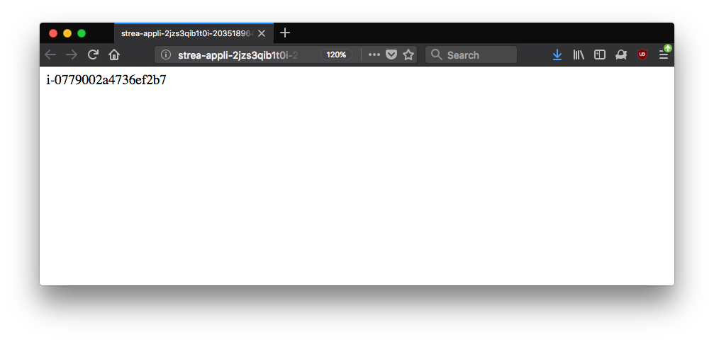

# Taking on the SteamCo DevOps Challenge

### By Tincho

## First Impressions of the task

- Glancing over all the tasks, they all made sense and understoof them, however the gritty details of how to complete them weren’t all that clear. 

- Prior experience with CloudFormation: 0

- in order to try and make the most effective use of learning, I thought YouTube would be the best spot to find some AWS resource about CF. Came across [this](https://www.youtube.com/watch?v=6R44BADNJA8) gem which only lasted 50 minutes, the same investment I would make for an episode of The Flash.

- _".. that return the instance id.."_  
Returning the Instance ID seem's pretty straight forward, though it will probably involve going through some docs to see if there is some CloudFormation function to get to it.

- _"Redirect any HTTP requests to HTTPS. Self-signed certificates are acceptable."_ 
It had been a while since I played around with self-signed certs, though I know it'll involve some calls to openssl with certian args and I'll be able to generate keys to then upload onto my instances

- _"Drive the deployment with Puppet."_
I know of Puppet, I know what it's used for and that it's a Ruby DSL for automating the provisioning of machines. I suspect that for provisioning whatever app I deploy should be pretty straight forward.

- _"Provide basic automated tests to cover included scripts, templates, manifests, recipes, code etc."_
I felt this would be my weakest point for the test, only that it would require a bit of research into what appropriate tools I can use in order to test everything. Puppet surely comes with their owns tests, however CloudFormation might be tricky.

## Getting Started

The AWS presenter in some video stated “The best CloudFormation config are one’s that are copied from someone”, which is a point of view I subscribe to aswell. So I looked for a config that seemed to have the the majority of what I needed, with the intention of then tweaking it.

I ended up coming across one which seemed to tick most boxes: [Auto Scaling Multi AZ with Notifications CF Template](https://s3.amazonaws.com/cloudformation-templates-us-east-1/AutoScalingMultiAZWithNotifications.template.)

I created a new KeyPair and ran the template inside an existing VPC I had. 

### First hiccup:

- Couldn't access the ELB through it’s domain name. 
- Traffic isn’t being forwarded onto the WebServers, however I was able to ssh into them
- Realised that HTTP connections weren't being allowed through the AWS 'firewall'
- I updated my template with a new security group thanks to  [markitx](https://github.com/markitx/cloud-formation-templates/blob/master/load-balancers.template#L102), and re-ran it all to ensure it worked fine. And it did.

## Self critisism over VPC

* I looked at the funky VPC that my StreamCo app running in, and it was actually not the best possible setup as it was something hacked together for a previous project.
- Furthermore, I thought it beneficial for future people (including myself), be able to recreate this environment properly including all aspects of it. Our goal here is to achieve some form of reproduble build for our infrastructure
* While looking for a template to start off with, came across this nice image, which was a perfect representation of what I wanted to achieve: 
* Except 4 is a bit of overkill, we’ll just configure 2 of them
* Ran the aws-vpc.template formation with two AZ’s, in us-west-2a and us-west-2b, and with private subnets also being created (because we’ll use them later on for the extra credit tasks)

## Lets Encrypt Everything

- Found a nice guide for getting self-signed certs for Load balancers [link](https://medium.com/@chamilad/adding-a-self-signed-ssl-certificate-to-aws-acm-88a123a04301)
- Interestingly unable to use AWS::CertificateManager::Certificate as a parameter to CloudFormation. According to some documentation it's only available for public Certs that have been verified by email. So what I do is pass in the CRN as a string in CloudFormation parameter.
- We'll do the redirecting in Apache itself, allowing traffic to come from ELB straight through to our webservers on both 80 and 443

### Issues encountered

- Wasn't able to get my self signed certs into ACM, because I hadn't put in a FQDN. To check if they are properly uploaded, use the AWS cli `aws acm list-certificates`. Although they may appear in the web console, it doesn't count unless they appear in the cli output.